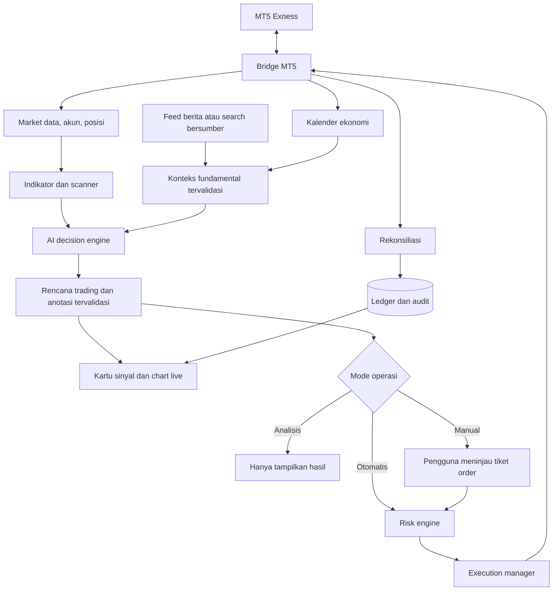

# AI Trading Improvement Plan

Status: **rencana, belum diimplementasikan**. Dibuat dan diperbarui 2026-10-03 dari review kode serta diskusi kebutuhan pengguna. Dokumen ini menjadi kumpulan utama ide improvement; pencatatan ide bukan bukti fitur sudah tersedia atau izin menjalankan trading.

**Pembaruan frontend 2026-10-03:** React/TypeScript/Vite + Tailwind/shadcn dan KLineChart sudah diimplementasikan serta diuji browser desktop/mobile. Ini implementasi lapisan dashboard P3 sebagian, bukan penyelesaian analisis AI, eksekusi, atau seluruh prioritas. Status historis P0/P1 dari sesi lain belum diverifikasi ulang pada tugas frontend.

## Prioritas pengerjaan — checklist untuk dipilih pengguna

**Rekomendasi paling utama: Prioritas 1, lalu Prioritas 2.** Fondasi eksekusi/data harus benar sebelum hasil AI digunakan. Hasil produk pertama yang ditargetkan adalah analisis XAUUSD pada chart aktif, kartu sinyal, dan gambar yang dapat diperiksa pada chart live.

Nomor **#1–#33** mempertahankan identitas dari checklist percakapan agar pengguna dapat memilih tanpa perubahan arti nomor. **Prioritas 1–7 adalah urutan pengerjaan yang direkomendasikan**, sedangkan **P0–P8 di bawah tetap ID kelompok teknis**, bukan urutan rilis. Checkbox menunjukkan implementasi selesai, bukan sekadar terpilih. Seluruh item belum dimulai.

### Prioritas 1 — Fondasi yang wajib dibenahi terlebih dahulu

- [x] **#1** Perbaiki PAPER agar tidak mengirim order ke MT5.
- [x] **#2** Cegah order ganda dan pulihkan status order setelah putus koneksi/restart.
- [x] **#3** Satukan alur data, konfigurasi, engine, dan dashboard yang diperlukan untuk MVP.
- [ ] **#4** Tampilkan akun Exness, koneksi, saldo, equity, dan posisi aktual. API/bridge/UI metadata akun, balance/equity/margin/profit dan jumlah posisi sudah dibuat; verifikasi terminal aktual dan rincian posisi masih terbuka. Centang historis dikoreksi karena belum ada bukti alur akun live.
- [ ] **#5** Validasi kesegaran data dan simpan histori candle.
- [ ] **#6** Perbaiki kompatibilitas worker pada Windows/mesin MT5 bila worker akan berjalan di sana.

Hasil yang harus terlihat: dashboard membaca sumber data yang jelas, PAPER terisolasi, dan status ambigu memblokir order baru. #3 tidak mensyaratkan rewrite Go atau migrasi database besar sebelum analisis pertama; fokus pada satu kontrak data/keputusan. Penentuan kebutuhan #6 dilakukan setelah topologi bridge/worker dipastikan.

Pemetaan: P0, P1, bagian dasar P3.

### Prioritas 2 — Fitur utama pertama: analisis AI dan gambar chart

- [ ] **#7** Integrasikan AI cloud kandidat Gemini; verifikasi model, kuota, dan manfaat langganan.
- [ ] **#8** Tombol Analisis Chart Aktif dengan LONG/SHORT/WAIT dan alasan.
- [ ] **#9** Kartu sinyal yang membuka chart live ketika diklik.
- [ ] **#10** Gambar zona entry, SL/TP, support/resistance, trendline, dan panah.
- [ ] **#11** Skenario utama/alternatif dengan trigger, invalidation, dan expiry.
- [ ] **#32** Simpan riwayat analisis, keputusan, dan alasan penolakan; riwayat order ditambahkan bersama jalur eksekusi.
- [ ] **#33** Monitor kuota/biaya AI serta hentikan permintaan saat batas tercapai.

Hasil yang harus terlihat: klik analisis XAUUSD → kartu penjelasan → chart live beranotasi. Rilis ini hanya analisis; teks fundamental belum boleh dianggap tersedia sebelum sumbernya terintegrasi. Audit dan batas kuota dibangun bersama integrasi AI, bukan ditunda hingga akhir.

Pemetaan: P4, bagian P3 dan audit/usage P8. Bergantung pada data valid Prioritas 1.

### Prioritas 3 — Modal, risiko, dan transaksi manual yang dapat diperiksa

- [ ] **#17** Input modal simulasi/alokasi trading.
- [ ] **#18** Profil risiko rendah/sedang/tinggi dengan nilai batas eksplisit.
- [ ] **#19** Hitung lot berdasarkan SL, modal, mata uang akun, dan spesifikasi broker.
- [ ] **#20** Batas kerugian harian, drawdown, jumlah posisi, dan total eksposur.
- [ ] **#29** Pisahkan kepemilikan posisi manual dan AI.
- [ ] **#25** Tiket manual dari sinyal: tinjau entry, lot, SL/TP, lalu BUY/SELL.

Hasil yang harus terlihat: pengguna dapat memeriksa rencana dan risiko dalam uang sebelum submit. Uji tiket/submit pada PAPER dahulu; pengujian order terminal DEMO membutuhkan lingkup pengguna yang jelas dan guard P0. Tidak ada submit terminal otomatis hanya karena tiket selesai dibuat.

Pemetaan: P6 dan P7. Bergantung pada Prioritas 1–2.

### Prioritas 4 — Lengkapi konteks sebelum otomatisasi

- [ ] **#12** Analisis multi-timeframe beserta kesimpulan dan konflik arah.
- [ ] **#21** Kalender ekonomi mendatang dengan countdown dan importance.
- [ ] **#22** Berita terbaru dengan sumber serta waktu publikasi.
- [ ] **#23** Gabungkan teknikal, berita, dan kalender dalam analisis AI.
- [ ] **#24** Filter entry sebelum/sesudah event penting sesuai kebijakan strategi.

Hasil yang harus terlihat: kartu/diagram analisis menunjukkan konteks lintas timeframe, sumber fundamental, dan alasan news filter. Sumber gagal/stale bukan berarti tidak ada berita. Parameter blackout ditetapkan sebelum dipakai.

Pemetaan: bagian multi-timeframe P5, MVP cloud/fundamental, P4, dan news filter P8.

### Prioritas 5 — Buktikan alur otomatis dalam simulasi

- [ ] **#30** Perbaiki backtest: waktu entry, spread, komisi, slippage, dan metrik.
- [ ] **#26** Tombol Mulai Trading dengan AI pada PAPER.
- [ ] **#28** Hentikan entry baru, lanjutkan sesi, dan tutup posisi AI sebagai aksi berbeda.
- [ ] **#31** Evaluasi strategi/AI dengan walk-forward dan forward PAPER.

Hasil yang harus terlihat: sesi otomatis pada satu simbol dapat dijalankan, dihentikan, dipulihkan, dan diaudit tanpa order terminal. Backtest diperbaiki sebelum hasilnya dipakai untuk menilai strategi; forward test memakai alur PAPER yang sudah berjalan. Kontrol #28 wajib hadir sebelum #26 dinyatakan selesai.

Pemetaan: P2 dan bagian PAPER/evaluasi P8. Untuk strategi yang memakai fundamental, data historis harus mengikuti waktu ketersediaan aslinya; jika belum tersedia, jangan mengklaim backtest fundamental lengkap.

### Prioritas 6 — Eksekusi otomatis pada akun DEMO

- [ ] **#27** Aktifkan trading otomatis AI DEMO setelah PAPER dan kriteria evaluasi lolos.

Hasil yang harus terlihat: perilaku diuji terhadap hasil terminal Exness, termasuk partial fill, timeout, restart, ARM, dan risk/news lock. Kelulusan mock/PAPER bukan bukti integrasi terminal. REAL tetap di luar tahap ini.

Pemetaan: bagian DEMO P8. Bergantung pada seluruh prasyarat eksekusi/evaluasi Prioritas 1–5.

### Prioritas 7 — Perluas dari XAUUSD ke banyak pasar

- [ ] **#13** Discovery daftar seluruh instrumen akun MT5.
- [ ] **#14** Scanner peluang forex, crypto, logam, dan kategori tersedia.
- [ ] **#15** Fokus XAUUSD saja, utamakan XAUUSD, atau universe pilihan.
- [ ] **#16** Ranking peluang berdasarkan kualitas setup dan kelayakan risiko.

Hasil yang harus terlihat: kandidat lintas pasar dapat dibandingkan dan dibuka ke chart/anotasi tanpa mengizinkan seluruhnya untuk auto-trading. Scanner analisis dapat dimajukan setelah Prioritas 2–4 bila pengguna memilihnya; tidak perlu menunggu DEMO. Eksekusi multi-instrumen tetap membutuhkan evaluasi portofolio tersendiri.

Pemetaan: bagian scanner P5 dan rekomendasi P6. Ditempatkan terakhir dalam rekomendasi rilis agar alur satu simbol terbukti dahulu, bukan karena discovery harus menunggu DEMO secara teknis.

**Pilihan scope awal yang direkomendasikan:** kerjakan Prioritas 1 dan 2; setelah hasil chart/analisis dapat ditinjau, lanjutkan Prioritas 3–5 sebelum meminta DEMO otomatis. Pemilihan scope implementasi belum dilakukan oleh pengguna pada tugas pengurutan ini.

## Kebutuhan produk dari pengguna

- Broker: **Exness Ltd**, melalui koneksi MT5 yang menurut pengguna sudah berhasil.
- Integrasi AI untuk analisis dan pengambilan keputusan LONG/SHORT, dengan pilihan eksekusi manual oleh pengguna atau otomatis oleh sistem.
- Tombol **Mulai Trading dengan AI**, **Analisis Chart Aktif**, **Analisis Semua Timeframe**, dan analisis teknikal.
- Pemindaian seluruh instrumen yang tersedia pada akun: forex, crypto, logam seperti XAUUSD, dan kategori lain yang tersedia.
- Hasil analisis berupa kartu sinyal/deskripsi teks yang dapat diklik untuk membuka chart live beserta gambar analisis.
- Skenario LONG/SHORT memiliki zona entry, SL/TP, kondisi pemicu, dan alasan yang dapat dipahami.
- Input modal/alokasi dan profil risiko; contoh modal $100 merupakan ilustrasi kebutuhan, bukan saldo aktual yang telah diverifikasi.
- Pilihan fokus XAUUSD atau mencari momentum alternatif di pasar lain yang sesuai profil pengguna.
- Analisis fundamental dari berita terbaru dan kalender event yang akan datang, sebagai konteks skenario dan keputusan entry.
- Prioritas AI cloud dengan kuota gratis atau manfaat langganan yang sudah dimiliki. Pengguna menyatakan berlangganan Gemini Pro serta ChatGPT/Codex; jenis paket, entitlement API, dan sisa kuota belum diperiksa.

## Usulan desain dan keputusan yang belum final

| Topik | Usulan | Status keputusan |
| --- | --- | --- |
| Backend | Backend modular dan worker; Go untuk API/orchestrator/risk/execution adalah opsi | Pengguna menanyakan Go, belum menetapkan migrasi |
| Koneksi MT5 | Pertahankan bridge yang bekerja; pilih bridge Python atau EA MQL5 yang diperluas | Metode aktif dan jalur eksekusi perlu diverifikasi |
| AI | Gemini API kandidat utama MVP; adapter provider/model yang dapat diganti dan keluaran terstruktur | Model, entitlement, budget, dan kredensial belum dipilih/diverifikasi |
| Perhitungan | Indikator dan lot dihitung deterministik; AI memilih serta menjelaskan skenario | Usulan arsitektur |
| Database | PostgreSQL sebagai kandidat sumber data bersama | Migrasi SQLite dan skema akhir belum diputuskan |
| Frontend | React/TypeScript/Vite, Tailwind CSS, shadcn/ui Base UI, KLineChart | Diimplementasikan untuk API yang tersedia; anotasi AI otomatis belum tersedia |
| Profil risiko | Rendah / Sedang / Tinggi, dengan nilai batas yang terlihat dan dapat diatur | Istilah dan nilai preset perlu ditetapkan; “menengah/sedang” tidak dibedakan secara arbitrer |
| Strategi | Strategi terversi dengan timeframe konteks/setup/entry yang eksplisit | Strategi utama dan parameter belum ditetapkan |
| Lingkungan | PAPER → DEMO; REAL sebagai fase terpisah | Tidak membuka blokir REAL pada scope awal |

Tidak perlu memecah sistem menjadi banyak microservice pada tahap awal. Python dapat tetap dipakai untuk bridge, eksperimen, atau training model jika diperlukan; migrasi Go bukan prasyarat fitur AI.

## MVP AI cloud, chart, eksekusi, dan fundamental

Status: **rancangan MVP, belum diimplementasikan**. Bagian ini memperjelas cakupan P4/P5/P7/P8, bukan mengganti prasyarat P0–P3.

### Target MVP bertahap

Rilis pertama yang dapat ditinjau adalah Prioritas 1–2 di atas. Daftar berikut adalah cakupan MVP lengkap bertahap; bukan syarat membangun seluruh fitur sebelum memperlihatkan analisis chart pertama.

1. Analisis XAUUSD pada timeframe pilihan menghasilkan kartu LONG/SHORT/WAIT, penjelasan, dan anotasi chart live.
2. Gabungkan data teknikal MT5 dengan berita terbaru yang bersumber jelas dan kalender event mendatang.
3. Sediakan tiket manual serta eksekusi otomatis PAPER melalui risk engine yang sama. DEMO otomatis mengikuti hasil evaluasi dan kriteria P8; REAL tetap di luar MVP.
4. Setelah alur satu simbol teruji, perluas ke multi-timeframe dan scanner seluruh instrumen yang tersedia melalui P5.

### Pilihan cloud dan manfaat langganan

| Opsi | Peran dalam rencana | Batasan yang harus diperiksa sebelum implementasi |
| --- | --- | --- |
| Gemini API free tier | Kandidat awal analisis dan keluaran terstruktur tanpa biaya inferensi dalam kuota | Model tersedia, limit request/token, dukungan schema/vision/tool, ketentuan data, dan akses akun |
| Kredit Google AI Pro | Opsi memanfaatkan langganan pengguna untuk pemakaian API yang memenuhi syarat | Dokumentasi Google pada diskusi menyebut $10 Cloud credits/bulan melalui aktivasi Google Developer Program; entitlement pengguna, penukaran, masa berlaku, dan penerapannya ke billing harus diverifikasi |
| OpenAI Platform API key | Alternatif provider bila diperlukan dan budget disepakati | Pemakaian API key ditagihkan terpisah; jangan menganggap langganan ChatGPT/Codex menjadi saldo API |
| Sign in with ChatGPT — plan usage | Kandidat alternatif memakai paket yang sudah dimiliki melalui jalur resmi | Dokumentasi yang dibahas mencakup aplikasi open-source/lokal yang memenuhi syarat; periksa kelayakan project, batas preview, model/tools, OAuth, dan kuota akun sebelum menjanjikan dukungan |

Belum ada provider yang diaktifkan atau diuji. Tidak ada klaim bahwa model tertentu terbukti paling menguntungkan untuk trading. Groq free tier dan Qwen/Ollama tetap alternatif eksplorasi dari diskusi sebelumnya; model lokal bukan prioritas MVP cloud ini dan tidak perlu menambah banyak provider pada rilis pertama.

Kredit langganan terbatas tidak sama dengan API unlimited atau seluruh sistem gratis. Biaya inferensi, pencarian web, feed berita, dan infrastruktur harus dicatat terpisah. Hindari model ID yang ditanam permanen sebelum verifikasi model yang benar-benar tersedia pada akun.

### Pembagian tiga kemampuan utama

- **Gambar chart:** AI menghasilkan objek terstruktur berisi waktu/harga, garis/zona/panah, dan alasan. Frontend menggambar overlay pada candle live. Tidak memerlukan layanan image generation berbayar. Input screenshot opsional hanya bila model vision didukung; OHLC/quote tetap sumber numerik utama.
- **LONG/SHORT:** AI menghasilkan rencana, backend menghitung lot dan memeriksa risiko, execution manager mengirim ke MT5. Model cloud tidak memiliki akses langsung ke kredensial broker atau fungsi submit tanpa validasi.
- **Fundamental/news:** kolektor memasok artikel/event dengan sumber dan timestamp; AI merangkum relevansi serta skenario dampaknya. Jadwal event mendatang tidak berarti hasil rilis sudah diketahui.

### Data berita dan kalender

- [ ] Tambahkan akses kalender ekonomi MQL5 melalui bridge; verifikasi ketersediaan pada terminal aktif, jangan menganggap candle bridge sekarang sudah mengirim kalender.
- [ ] Normalisasi waktu server trading ke UTC dengan offset yang benar, termasuk perubahan offset/DST jika relevan; UI boleh menampilkan WIB.
- [ ] Simpan event ID, sumber, negara/mata uang, judul, waktu rilis, importance, previous, forecast bila tersedia, actual setelah rilis, revisi, dan waktu pembaruan.
- [ ] Ambil berita terbaru melalui feed/API yang mengizinkan penggunaan atau search grounding. Pilih sumber beserta biaya/cakupannya; kalender MT5 tidak dianggap mencakup seluruh berita crypto/geopolitik.
- [ ] Simpan URL/penerbit, published_at, retrieved_at, symbol/mata uang terkait, ringkasan, serta status duplikasi/koreksi.
- [ ] Google Search grounding bersifat opsional dan bergantung model/tier. Free tier inferensi tidak otomatis berarti pencarian gratis; jangan mengaktifkan fitur berbayar sebagai fallback diam-diam.
- [ ] Pisahkan fakta sumber, forecast/konsensus, dan interpretasi AI. Informasi yang belum tersedia tetap null/unavailable, bukan nol atau angka buatan.
- [ ] Tampilkan panel event mendatang, countdown, berita terbaru, relevansi terhadap instrumen, sumber, dan umur data pada kartu/chart.
- [ ] Sediakan kebijakan news filter/blackout sebelum-sesudah event menurut strategi; durasi belum ditentukan. Data news stale/gagal tidak boleh dilabeli “tidak ada event”.
- [ ] Analisis ulang setelah rilis memakai snapshot dan actual yang baru; jangan menulis ulang analisis sebelum rilis atau membocorkan actual masa depan ke backtest.

### Kontrol kuota, biaya, dan kegagalan

- [ ] Scanner indikator berjalan lokal; panggil AI untuk permintaan pengguna, kandidat terpilih, candle close, atau event relevan sesuai strategi.
- [ ] Cache berdasarkan snapshot, versi strategi/model, dan waktu relevan; cache berita/analisis expired tidak dipakai untuk submit baru.
- [ ] Tampilkan provider/model aktif, latency, kuota/error yang tersedia, serta estimasi pemakaian dan biaya per kategori. Budget alert provider bukan jaminan hard stop; tegakkan batas aplikasi sendiri.
- [ ] Saat kuota habis, pencarian tidak tersedia, atau AI timeout: tandai analisis tidak tersedia dan hentikan entry yang bergantung pada data tersebut. Proteksi posisi yang sudah terbuka tetap aktif.
- [ ] Fallback provider/model untuk eksekusi hanya boleh memakai konfigurasi yang sudah dievaluasi; jangan mengganti model diam-diam saat rate limit.
- [ ] Kirim data pasar minimum yang diperlukan; kredensial, identitas akun, dan perhitungan sizing tetap di backend. Periksa ketentuan penggunaan data layanan gratis sebelum memakai data sensitif.

### Kriteria penerimaan MVP cloud

- Chart aktif menghasilkan analisis tersimpan dan anotasi yang konsisten dengan kartu sinyal.
- Setiap klaim berita memiliki sumber dan timestamp; setiap event mendatang memiliki jadwal serta status data. Forecast dibedakan dari actual.
- Skenario news unavailable, rate limit, expired, dan output model invalid diuji tanpa order baru yang tidak tervalidasi.
- Pipeline analisis → risk → PAPER berjalan tanpa order terminal; DEMO tidak dibuka hanya karena analisis terlihat meyakinkan.
- Manfaat langganan, model ID, biaya grounding/feed, dan batas pemakaian dicatat berdasarkan akun yang diverifikasi sebelum live API diaktifkan.
- Tidak ada klaim gratis unlimited, prediksi hasil berita yang pasti, atau profit terjamin.

## Alur produk dan batas komponen

- **Mode operasi** terpisah dari **lingkungan**: Analisis/Manual/Otomatis menentukan alur keputusan; PAPER/DEMO/REAL menentukan tujuan eksekusi.
- AI mengusulkan LONG, SHORT, WAIT, CLOSE, atau MODIFY. Risk engine dapat menolak; AI tidak boleh menaikkan batas risiko atau mengirim order langsung.
- Analisis menggunakan snapshot data dengan timestamp. Quote, margin, posisi, dan risiko diperiksa lagi menjelang submit, termasuk setelah persetujuan manual.
- Konteks AI berasal dari OHLC, quote, indikator, spesifikasi kontrak, dan state akun. Screenshot boleh melengkapi, bukan menggantikan data numerik.
- Berita/sentimen dapat ditambahkan ketika sumber, timestamp, cakupan, dan biaya jelas. Data eksternal diperlakukan sebagai data, bukan instruksi untuk mengubah aturan trading.
- Kegagalan AI tidak menghentikan perlindungan posisi yang sudah terbuka. SL/TP broker dan pengelolaan deterministik tetap berjalan sesuai kebijakan sesi.

## Kontrak data yang diusulkan

| Entitas | Data utama |
| --- | --- |
| MarketSnapshot | Account/server, symbol asli, bid/ask, candle tertutup dan candle berjalan yang dibedakan, timeframe, waktu sumber/terima, indikator, kualitas data |
| Analysis | ID, versi, snapshot ID, symbol, timeframe terkait, model/prompt/strategy version, penjelasan, durasi/biaya, expiry |
| Scenario | ID, LONG/SHORT/WAIT, kondisi trigger, entry zone, SL, target, invalidation, alternatif terkait, status |
| ChartAnnotation | Analysis/scenario ID, jenis garis/zona/panah/label, anchor waktu dan harga, teks, versi |
| RiskProfile | Alokasi, mata uang akun, basis sizing, batas per transaksi/harian/drawdown/eksposur/posisi, daftar instrumen yang diizinkan |
| TradingSession | Mode, lingkungan, akun, strategi dan risk profile version, watchlist, status, waktu mulai/berakhir, alasan pause |
| OrderIntent | Session/scenario ID, idempotency key, arah, volume, harga/SL/TP, asal manual/AI, status submit, ticket broker |
| ScanJob | Universe, timeframe, snapshot/cutoff, progres, sukses/gagal/skipped, kandidat, status pembatalan |
| EconomicEvent | Sumber/event ID, mata uang, waktu rilis UTC dan waktu sumber, importance, previous/forecast/actual/revisi, updated_at |
| NewsItem | URL, penerbit, published_at/retrieved_at, relevansi instrumen, ringkasan, kualitas/freshness |
| AIUsage | Provider/model, request/analysis ID, token/tool usage, latency, estimasi biaya, status quota/error; tanpa secret |

Kontrak ini adalah rancangan, belum merupakan schema database atau API yang diimplementasikan. Pemilihan field detail dilakukan saat tahap terkait dikerjakan.

## Cara memakai roadmap

- Kerjakan sesuai lingkup permintaan pengguna. P0–P3 mempertahankan backlog fondasi dari review awal; P4–P8 menambahkan kebutuhan produk AI. Nomor adalah kelompok pekerjaan, bukan kewajiban mengerjakan semua kelompok sekaligus.
- Gunakan Prioritas 1–7 pada awal dokumen sebagai urutan rilis: fondasi → analisis/gambar → risiko/manual → multi-timeframe/fundamental → evaluasi/PAPER → DEMO → perluasan scanner. ID teknis P0–P8 tetap untuk pelacakan acceptance criteria. Scanner analisis dapat dimajukan sesuai dependensinya; P2 dan evaluasi wajib sebelum promosi DEMO otomatis.
- Status yang dipakai: Belum dimulai, Dikerjakan, Terblokir, Selesai.
- Catat bukti verifikasi dan batasannya di `WORKLOG.md`. Checkbox hanya ditutup setelah kriteria terkait terpenuhi.
- Perbaikan default tidak mengganti strategi atau ambang risiko tanpa kebutuhan yang jelas.

## P0 — Keandalan eksekusi

Status: **Selesai**. Temuan terkait: F01, F02, F10 telah diperbaiki.

- [x] Pisahkan broker eksekusi dari sumber data. PAPER selalu memakai simulator meskipun data berasal dari MT5.
- [x] Pertahankan PAUSED selama masih ada order ambigu; ARM tidak boleh melewati blokir tersebut.
- [x] Tangani partial fill, submit ambigu, dan pembacaan state broker yang gagal secara eksplisit.
- [x] Periksa akun aktual sebelum submit DEMO dan pertahankan blokir REAL/CONTEST.
- [x] Ganti lock worker dengan mekanisme yang mendukung OS target tanpa melemahkan single-worker guarantee.

Kriteria selesai:

- Regresi dengan fake MT5 membuktikan PAPER + sumber MT5 tidak pernah memanggil `order_send`.
- Restart, ARM, dan percobaan bar baru tetap tidak mengirim order selama UNKNOWN belum terselesaikan.
- Test membedakan rejected, partial, filled, dan unknown; kegagalan membaca posisi tidak dianggap nol posisi.
- Test akun non-DEMO menolak submit; restart tidak otomatis ARM.
- Lock diuji pada OS yang tersedia; hasil Windows harus dilaporkan belum terverifikasi jika belum diuji di Windows.

## P1 — Satu alur data dan keputusan

Status: **Selesai**. Temuan terkait: F03, F04, F05, F06, F09 telah diperbaiki.

- [x] Dokumentasikan kontrak provider data, strategy decision, risk decision, execution, dan penyimpanan bersama.
- [x] Selaraskan konfigurasi web/core dengan validasi yang menolak key tidak dikenal atau menyediakan mapping eksplisit.
- [x] Buat rencana migrasi storage yang menjaga histori; tentukan sumber utama sebelum migrasi.
- [x] Tambahkan validasi candle, kesegaran data, heartbeat, dan penyimpanan histori.
- [x] Satukan perhitungan indikator dan perbaiki kasus batas RSI.
- [x] Hubungkan regime ke candle nyata; gunakan status belum tersedia ketika data tidak cukup.
- [x] Ganti nilai decision/risk contoh dengan perhitungan nyata; fitur statistik yang belum berjalan harus mengembalikan status yang jujur.
- [x] Sediakan marker strategi dan order aktual yang dapat dibedakan dari crossover indikator.

Kriteria selesai:

- Fixture pasar yang sama menghasilkan indikator dan keputusan yang konsisten di API, worker, dan simulasi.
- Data lama atau tidak valid terlihat pada API/UI dan tidak meloloskan keputusan eksekusi baru.
- Konfigurasi yang ditampilkan sesuai nilai efektif engine; kesalahan key tidak diam-diam memakai default.
- Tidak ada confidence, harga keputusan, hasil statistik, atau task sukses palsu dari placeholder.
- Pengujian integrasi dari candle masuk sampai keputusan tersimpan berjalan dengan broker simulator.

## P2 — Backtest yang dapat diperiksa

Status: **Belum dimulai**. Temuan terkait: F07, F08. Memakai kontrak domain P1.

- [ ] Inject clock simulasi ke penilaian umur data dan baseline risiko.
- [ ] Pastikan sinyal candle t dieksekusi pada pembukaan t+1 tanpa mengakses informasi masa depan.
- [ ] Terapkan spread, komisi, slippage, gap, serta aturan ketika SL/TP tersentuh pada candle yang sama secara eksplisit.
- [ ] Hitung ulang konsistensi saldo, equity, drawdown, dan likuidasi akhir terhadap ledger trade.
- [ ] Implementasikan walk-forward/Monte Carlo sebagai pekerjaan nyata dengan status dan hasil yang tersimpan, jika masuk lingkup implementasi.

Kriteria selesai:

- Dataset kecil dengan hasil yang dihitung manual membuktikan waktu entry, fill, biaya, exit, dan metrik.
- Backtest historis tidak ditolak hanya karena tanggal simulasi berbeda dari waktu komputer.
- Hasil dapat direproduksi dengan dataset, konfigurasi, versi strategi, dan seed simulasi yang dicatat.
- Endpoint pekerjaan analisis tidak menyatakan dimulai jika tidak ada proses yang benar-benar dijadwalkan.

## P3 — Dashboard operasional

Status: **Dikerjakan (frontend selesai untuk endpoint yang tersedia)**. Bergantung pada data/kontrak P1, serta P0 untuk kontrol eksekusi. Chart/indikator/gambar manual, overlay entry/SL sinyal database, ringkasan, dan state unavailable telah dibuat. Data akun/saldo/equity/margin dan jumlah posisi sudah memiliki API/bridge/UI; verifikasi terminal live masih menunggu pembaruan EA. Kalkulator memakai balance MT5. Rincian posisi/worker, AI, dan kontrol eksekusi masih membutuhkan integrasi backend.

- [ ] Tampilkan mode, status worker, koneksi, umur data, dan identitas broker/server yang relevan.
- [ ] Tampilkan balance/equity, floating P/L, posisi, dan order dari sumber yang jelas.
- [ ] Tampilkan alasan HOLD/reject, status risiko, dan riwayat keputusan.
- [ ] Tambahkan overlay entry/SL/TP dari sinyal atau posisi aktual dengan label yang berbeda.
- [ ] Hubungkan pause/resume dan ARM ke state worker yang sebenarnya, dengan prasyarat P0.
- [x] Verifikasi tampilan loading, kosong, stale, error, desktop, dan mobile untuk frontend baru melalui Playwright dengan fixture API. Ini tidak memverifikasi feed terminal aktual.
- [x] Log sistem dari sidebar: request API/bridge, alasan error, diagnosis cache, filter/detail/export dan pembaruan otomatis. Cakupan sesi API (1.000 event dalam memori), bukan Journal terminal atau audit trading persisten.

Kriteria selesai:

- Status dashboard sesuai engine dan tidak menganggap chart tersambung berarti trading aktif.
- Nilai unavailable tidak ditampilkan sebagai nol/sukses palsu.
- Interaksi kontrol memiliki hasil berhasil/gagal yang dapat diperiksa dan tercatat.
- Reconnect/restart tidak menggandakan order atau menyembunyikan status unresolved.

## P4 — Analisis AI, kartu sinyal, dan gambar pada chart live

Status: **Belum dimulai**. Bergantung pada P1 dan dashboard dasar P3.

- [ ] Implementasikan tombol Analisis Chart Aktif dengan snapshot symbol/timeframe aktif dan konteks pasar yang relevan.
- [ ] Hitung trend, struktur harga, support/resistance, EMA, RSI, MACD, ATR, ADX, Bollinger Bands, volatilitas, spread, dan sesi dengan definisi yang dapat diuji; jangan sekadar menambah indikator tanpa fungsi keputusan.
- [ ] Integrasikan AI melalui adapter provider dengan schema output, timeout, validasi, pencatatan versi, dan batas biaya.
- [ ] Terapkan rancangan MVP cloud di atas: Gemini sebagai kandidat awal, kalender MQL5 dan sumber berita terverifikasi sebagai konteks analisis, serta manfaat langganan yang diperiksa sebelum aktivasi.
- [ ] Sediakan skenario utama dan alternatif LONG/SHORT bila didukung data, serta WAIT jika tidak ada setup. Jangan memaksakan dua arah atau transaksi pada setiap analisis.
- [ ] Tampilkan kartu berisi symbol/timeframe, arah, alasan, trigger, entry zone, SL/target, invalidation, waktu analisis, expiry, dan status.
- [ ] Klik Lihat Chart Live membuka symbol/timeframe yang tepat dengan anotasi dari analysis ID tersebut.
- [ ] Render garis support/resistance/trendline, zona entry, SL/TP, panah, dan label sebagai objek waktu/harga pada chart; bukan raster statis dari AI.
- [ ] Validasi angka, urutan harga, koordinat waktu, dan konsistensi anotasi terhadap skenario. Frontend merender objek yang diizinkan, bukan menjalankan kode hasil AI.
- [ ] Dukung zoom, pan, toggle objek, legenda skenario, dan tampilan yang tetap terbaca pada desktop/mobile.
- [ ] Pisahkan status skenario (menunggu, terpicu, expired, invalidated) dari status order (belum dikirim, submitting, filled, dan seterusnya).
- [ ] Jika skenario alternatif saling eksklusif, aktivasi salah satunya membatalkan alternatif secara atomik sesuai strategi.
- [ ] Simpan versi analisis dan anotasi; analisis ulang membuat versi baru, tidak menggeser entry/SL historis diam-diam.

Kriteria selesai:

- Klik kartu membuka chart live dan objek tetap melekat pada koordinat yang benar setelah candle baru, zoom, atau reload.
- Teks, gambar, dan tiket order merujuk level serta versi skenario yang sama.
- WAIT, output AI invalid, timeout, data kurang, dan hasil expired tidak menghasilkan order atau sinyal sukses palsu.
- Kedua skenario alternatif tidak dapat menghasilkan dua order yang saling bertentangan akibat race.
- Confidence model diberi label sebagai skor; tidak ditampilkan sebagai peluang menang sebelum ada kalibrasi dengan hasil aktual.

## P5 — Analisis multi-timeframe dan scanner lintas instrumen

Status: **Belum dimulai**. Bergantung pada P1 dan P4.

- [ ] Temukan instrumen dari akun MT5 aktif, termasuk symbol suffix asli, kategori, status trading, jam pasar, dan spesifikasi kontrak.
- [ ] Bedakan universe analisis, watchlist, dan allowlist eksekusi otomatis. Pemindaian semua instrumen tidak otomatis mengizinkan semua instrumen ditradingkan.
- [ ] Sediakan Analisis Semua Timeframe untuk timeframe yang didukung dan dipilih; tampilkan yang tidak tersedia atau kekurangan histori.
- [ ] Tampilkan arah/kondisi setiap timeframe, konflik, serta ringkasan. Contoh D1/H4 konteks, H1/M15 setup, M5/M1 entry adalah preset usulan, bukan aturan permanen.
- [ ] Selaraskan candle berdasarkan cutoff waktu; pisahkan observasi intrabar dari sinyal yang memerlukan candle close.
- [ ] Jalankan Scan Semua Instrumen sebagai background job dengan progres, cancel, retry terbatas, dan hasil parsial.
- [ ] Scanner deterministik menyaring kandidat; AI mendalami kandidat yang relevan dengan batas concurrency, cache, rate limit, dan budget.
- [ ] Tampilkan cakupan: jumlah diminta/dipindai/gagal/skipped serta kedalaman analisis teknikal versus AI. Jangan mengklaim seluruh instrumen dianalisis AI bila hanya shortlist yang diproses AI.
- [ ] Sediakan filter forex/crypto/logam/indeks/kategori tersedia, timeframe, status setup, dan kelayakan risiko.
- [ ] Perbarui saat candle baru atau trigger relevan; hindari memanggil AI untuk setiap tick tanpa kebutuhan strategi.

Kriteria selesai:

- Universe mengikuti akun yang aktif dan cache akun/server berbeda tidak bercampur.
- Data kurang, pasar tutup, symbol tidak dapat ditradingkan, dan kegagalan parsial terlihat dengan alasan.
- Semua kartu kandidat dapat membuka chart/anotasi terkait.
- Job dapat dibatalkan tanpa menyatakan pekerjaan yang belum diproses sebagai selesai; scan tidak mengirim order.
- Hasil multi-timeframe tidak membaca candle masa depan dan menampilkan konflik alih-alih memaksakan kesepakatan.

## P6 — Modal, profil risiko, dan rekomendasi peluang

Status: **Belum dimulai**. Bergantung pada P1; rekomendasi lintas pasar memakai P5.

- [ ] Input modal simulasi atau alokasi akun. Pada koneksi nyata, balance/equity/margin berasal dari MT5; input alokasi tidak mengganti saldo terminal.
- [ ] Sediakan preset risiko dengan nama tidak ambigu, nilai persentase dan uang yang terlihat, serta konfigurasi batas eksplisit. Nilai preset belum ditetapkan dalam diskusi.
- [ ] Tentukan basis sizing (alokasi/equity) secara eksplisit dan batasi pada kapasitas akun aktual; jangan menganggap semua akun bermata uang USD.
- [ ] Tambahkan batas per transaksi, kerugian harian, drawdown, jumlah posisi, total risiko terbuka, margin, dan eksposur mata uang yang berkorelasi.
- [ ] Hitung lot dari jarak SL dan spesifikasi broker; bulatkan ke bawah sesuai volume step, periksa volume minimum/maksimum, biaya, dan margin.
- [ ] Jika lot minimum melewati budget, tolak kandidat dengan alasan. Jangan menaikkan lot atau mempersempit SL sembarang untuk memaksa kelayakan.
- [ ] Pilih fokus XAUUSD saja, utamakan XAUUSD dengan alternatif, atau universe terpilih.
- [ ] Urutkan peluang menurut setup, trigger, biaya, likuiditas/data tersedia, risiko, dan kesesuaian portofolio; tampilkan alasan ranking.
- [ ] Tampilkan “belum ada entry yang memenuhi kriteria” bila tidak ada kandidat layak; jangan menjanjikan profit atau selalu mencari transaksi pengganti.
- [ ] Perubahan profil menghasilkan versi baru; order/posisi yang sudah ada tidak diubah diam-diam.

Contoh ilustratif: alokasi $100 × batas 0,5% = budget kerugian target $0,50 per transaksi. Angka ini bukan preset yang disepakati atau rekomendasi risiko. Kerugian aktual dapat berbeda akibat gap/slippage; kelayakan lot harus dihitung dari kontrak akun.

Kriteria selesai:

- Test sizing mencakup mata uang akun, lot minimum/step, SL tidak valid, margin kurang, biaya, dan beberapa posisi bersamaan.
- Kandidat menarik secara teknikal tetapi tidak layak risiko tetap ditandai tidak dapat dieksekusi.
- Anggaran total dihitung juga terhadap posisi manual serta intent yang belum selesai agar entry paralel tidak melampaui batas.
- UI menampilkan nilai efektif yang sama dengan risk engine dan alasan penolakan yang dapat dipahami.

## P7 — Eksekusi manual dengan bantuan AI

Status: **Belum dimulai**. Bergantung pada P0, P3, P4, dan P6.

- [ ] Sediakan mode Analisis tanpa submit dan mode Manual dengan tombol Siapkan Order dari kartu/chart.
- [ ] Tiket order menampilkan akun/lingkungan, entry, SL/TP, lot, estimasi risiko/biaya/margin, serta analysis/scenario version.
- [ ] Perubahan parameter oleh pengguna memicu kalkulasi dan validasi ulang.
- [ ] Persetujuan manual berlaku pada rencana yang ditampilkan; quote bergerak melewati toleransi atau rencana berubah mengharuskan review ulang sesuai kontrak UI.
- [ ] Jalankan validasi terbaru sebelum submit dan idempotency untuk klik ganda/retry.
- [ ] Catat asal posisi (manual/AI/eksternal). Posisi manual hanya dikelola AI bila pengguna menyerahkannya secara eksplisit; eksposurnya tetap dihitung pada risiko akun.

Kriteria selesai:

- Analisis dan membuka kartu tidak mengirim order.
- Klik ganda, refresh, timeout, dan retry tidak menggandakan transaksi.
- Tiket broker serta status hasil ditampilkan; sinyal terpicu tidak dianggap filled tanpa bukti broker.
- AI tidak memodifikasi/menutup posisi manual yang belum diserahkan kepadanya.

## P8 — Sesi trading otomatis AI dan evaluasi

Status: **Belum dimulai**. Bergantung pada P0–P7 yang relevan; validasi P2 dan evaluasi AI diperlukan sebelum DEMO otomatis.

- [ ] Tombol Mulai Trading dengan AI membuat sesi dengan akun, lingkungan, watchlist, strategi, versi profil risiko, dan kebijakan pengelolaan posisi yang terlihat.
- [ ] Pisahkan mode Analisis/Manual/Otomatis dari tujuan PAPER/DEMO. PAPER dengan data MT5 tetap memakai broker simulator.
- [ ] AI memilih LONG/SHORT/WAIT/CLOSE/MODIFY dalam kontrak yang dibatasi; risk engine dan execution manager memiliki wewenang akhir untuk menolak.
- [ ] Definisikan state sesi dan transisi start/pause/resume/stop/error/reconciliation; restart tidak mengaktifkan ARM otomatis.
- [ ] Sediakan Hentikan Entry Baru terpisah dari Tutup Posisi AI. Jelaskan bahwa pengelolaan posisi yang sudah ada tetap berjalan saat entry dihentikan.
- [ ] Sediakan perlindungan broker SL/TP bila didukung, serta kebijakan ketika AI/bridge gagal, koneksi terputus, akun berganti, atau data stale.
- [ ] Simpan keputusan, snapshot, prompt/model/strategy version, biaya, latency, risk rejection, intent, dan hasil broker dalam audit.
- [ ] Validasi schema AI; timeout, output invalid, budget habis, dan keputusan expired tidak membuka posisi baru.
- [ ] Terapkan news filter sesuai kebijakan sesi dan freshness sumber; audit apakah keputusan dibuat sebelum/sesudah rilis beserta snapshot fundamentalnya.
- [ ] Rekonsiliasi submit ambigu sebelum retry dan batasi pengirim order agar hanya satu otoritas per akun.
- [ ] Evaluasi dengan replay data, backtest, walk-forward/holdout, pengujian biaya, dan forward PAPER sebelum DEMO.
- [ ] Rekam respons model saat evaluasi; jangan menganggap pemanggilan ulang model selalu menghasilkan keluaran identik. Uji konsistensi, WAIT/reject rate, hasil bersih, drawdown, slippage, latency, dan biaya AI.
- [ ] Evaluasi kalibrasi skor confidence terhadap outcome yang didefinisikan jelas; jangan meningkatkan risiko hanya karena model menyatakan yakin.

Kriteria selesai:

- Sesi PAPER berjalan end-to-end tanpa order terminal, termasuk kondisi gagal dan restart.
- Transisi stop/pause tidak mengabaikan posisi terbuka, dan aksi tutup hanya mengenai posisi yang dimiliki/dikelola sesi.
- Setiap submit dapat ditelusuri ke snapshot, keputusan, risk approval, session, dan ticket; order duplikat serta budget race dicegah.
- Uji DEMO dicatat terpisah dari mock/PAPER dengan bukti hasil terminal; kelulusan pengujian tidak dipresentasikan sebagai jaminan profit.
- Kriteria promosi, dataset, periode evaluasi, dan batas metrik ditetapkan sebelum uji; tidak mengarang ambang kelulusan setelah melihat hasil.

## Di luar tahap awal dan keputusan berikutnya

- Eksekusi REAL, optimasi parameter otomatis, training model baru, dan deployment publik tetap fase tersendiri.
- Integrasi AI termasuk target produk. Provider/model, penggunaan layanan berbayar atau lokal, dan budget dipilih saat implementasi; belum ada API berbayar yang diaktifkan oleh dokumen ini.
- Sebelum implementasi terkait, tetapkan stack akhir, metode bridge, daftar timeframe, strategi pertama, parameter preset risiko, dan sumber data eksternal bila dibutuhkan.
- Perbaikan P0 tetap dapat dikerjakan tanpa menunggu keputusan provider AI atau migrasi Go.

## Referensi integrasi yang dibahas

- [MT5 Python integration](https://www.mql5.com/en/docs/python_metatrader5): akses data, akun, dan operasi terminal.
- [MT5 symbols_get](https://www.mql5.com/en/docs/python_metatrader5/mt5symbolsget_py): discovery instrumen.
- [MQL5 WebRequest](https://www.mql5.com/en/docs/network/webrequest): komunikasi HTTP EA dengan backend, termasuk backend Go.
- [MT5 order_check](https://www.mql5.com/en/docs/python_metatrader5/mt5ordercheck_py): pemeriksaan sebelum submit, bukan jaminan fill.
- [Instrumen Exness](https://get.exness.help/hc/en-us/articles/360010646760-Available-trading-instruments): ketersediaan menurut akun/platform; crypto yang dibahas dalam integrasi ini mengikuti kontrak CFD broker, bukan otomatis aset spot.
- [Gemini API pricing](https://ai.google.dev/gemini-api/docs/pricing): free tier dan biaya tool/grounding menurut model.
- [Google AI Pro benefits](https://support.google.com/googleone/answer/14534406?hl=en): manfaat Developer Program dan syarat aktivasi.
- [Google Cloud credits untuk pelanggan AI Pro/Ultra](https://blog.google/innovation-and-ai/technology/developers-tools/gdp-premium-ai-pro-ultra/): penggunaan kredit untuk Gemini API.
- [OpenAI authentication](https://learn.chatgpt.com/docs/auth): perbedaan akses subscription dan penggunaan API key.
- [ChatGPT plan usage](https://developers.openai.com/siwc/token-sharing-open-source): jalur resmi aplikasi yang memenuhi syarat; bukan jaminan entitlement project ini.
- [MQL5 Economic Calendar](https://www.mql5.com/en/docs/calendar): event ekonomi dan penggunaan waktu server trading.

Referensi berasal dari penelusuran pada diskusi desain. Verifikasi kembali kontrak aktual terminal dan dokumentasi ketika implementasi dimulai.
